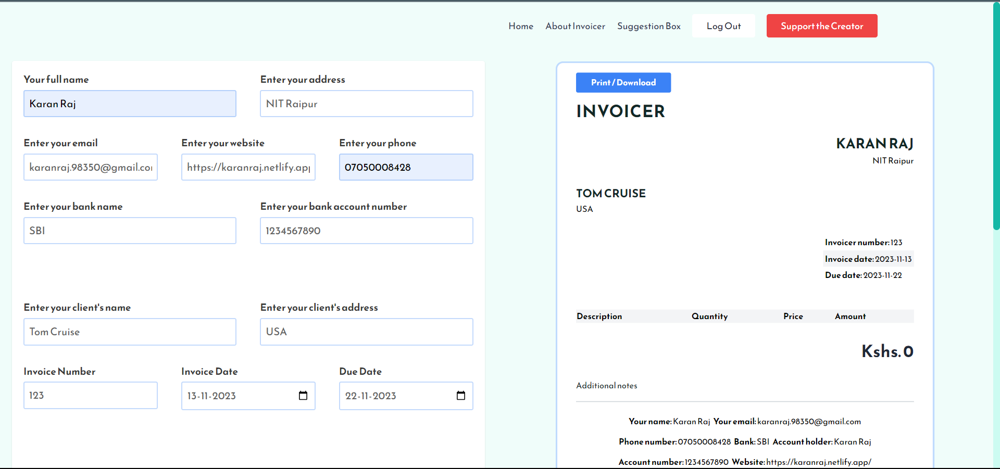

# Invoice Reminder and Follow-up Automation with Zapier Integration
Live Link: https://invoicereminder.netlify.app/
Note: The hosted live link is for demo.
For following proper web-app just go through this whole github files and you can run on your local host too. It will work properly.

## Current Features

1. Form to capture yours and your client's data such as full name, email address, physical address, website and your bank account details.
2. Google OAuth integration: Implemented a user interface for users to log in using their Google accounts.
3. Input invoice number, invoice date and due date.
4. Create invoice table - add, edit and remove items from your table.
5. See the total amount of items in the table.
6. Write additional notes to your client such as how to pay, bank details and so on and so forth.
7. Follow-up Automation
8. Zapier Integration
9. Preview your invoice.
10. Print your invoice.

### Built by [Karan Raj]
